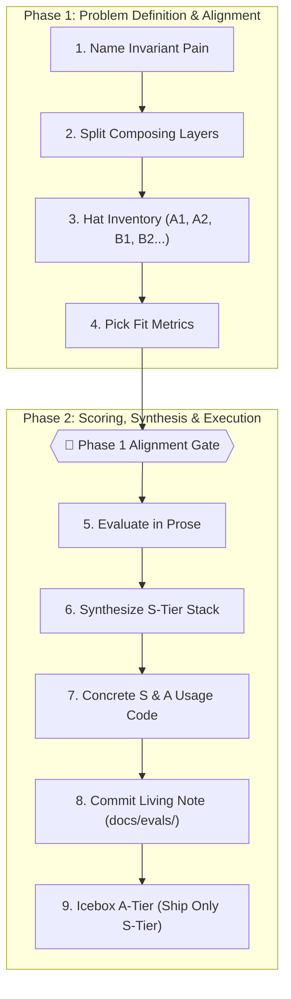
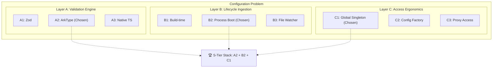

# 🎩 The Hat

> **An agent-native, living evaluation framework for technical design and architecture.**  
> Stop vibe-ranking in chat. Eliminate false choices with layer splitting. Ship the S-Tier stack and icebox the rest.

[](https://www.npmjs.com/package/the-hat)
[](LICENSE)
[](https://github.com/yamcodes/the-hat)

---

## ⚡ Quickstart

### 1. Initialize in Any Project
Instantly scaffold `docs/evals/`, evaluation templates, and AI agent skills in your repository:

```bash
npx the-hat init
```

### 2. Create a Living Evaluation Note
```bash
npx the-hat new api-wiring
```
Or for small, 1-page decisions:
```bash
npx the-hat new cache-strategy --minimal
```

### 3. Ask Your AI Assistant
In Cursor, Claude Code, Antigravity, or GitHub Copilot:
> *"Throw this in the hat: /the-hat"*

---

## 💡 Why The Hat?

Every engineering team and AI agent struggles with architectural decisions:

| The Trap | What Goes Wrong | How The Hat Fixes It |
| :--- | :--- | :--- |
| **Vibe-Ranking** | Pros/cons debated in chat without objective metrics; conclusions lost in chat history. | **Problem-Tailored Metrics & Living Notes:** All options evaluated against explicit rubrics and committed to `docs/evals/`. |
| **False Choices** | Orthogonal concerns (such as *Parameter Typing* vs *Wrapper Placement*) forced into a zero-sum deathmatch. | **Layer Splitting:** Deconstructs problems into independent dimensions that compose into complete **Stacks**. |
| **Premature ADRs** | Heavy, static post-mortems that bury rejected alternatives, causing bad ideas to resurface repeatedly. | **Living Hat Inventory:** Keeps rejected ideas scored in the note so they never silently resurface. |
| **Scope Creep** | Great secondary ideas bloat PRs and delay shipping. | **The A-Tier Icebox:** Preserves high-value extensions without letting them block immediate S-Tier delivery. |

---

## 🔄 The 9-Step Evaluation Loop

The evaluation loop is split into two distinct phases with a mandatory alignment gate between them:



### Phase 1: Problem Definition & Alignment
1. **Name the Problem:** Define what must be true when done (the invariant user pain and constraints).
2. **Split Composing Layers:** Separate orthogonal dimensions (items in the same layer compete; items across layers compose).
3. **Put Every Option in the Hat:** Assign IDs (`A1`, `A2`, `B1`, `B2`), including rejected and out-of-scope ideas.
4. **Pick Fit Metrics:** Frame 3 to 6 questions testing the exact pain (Honesty, Maintenance Burden, DX, Zero-Weight Tax, etc.).

> **🛑 AI Agent Gate:** The agent halts after Step 4 to get user alignment on the problem decomposition before computing scores.

### Phase 2: Scoring, Synthesis & Execution
5. **Evaluate in Prose:** Score every option against every metric in technical prose.
6. **Tier List & Stack Synthesis:**
   - **🏆 S-Tier:** The chosen composite stack (`A2 + B2`) to ship now.
   - **❄️ A-Tier (The A-Tier Icebox):** Highly rated ideas preserved for later, not blocking today.
   - **🟡 B-Tier:** Viable contingency fallbacks.
   - **🔴 C/D/E-Tier:** Defeated options with fatal flaws recorded.
7. **Concrete S & A Usage:** Provide real, working code examples for all primary use cases.
8. **Keep a Living Note:** Save to `docs/evals/<topic>.md`.
9. **Do Not Ship A-Tier Extras:** Strictly restrict the immediate PR to the S-Tier deliverable.

---

## 🧩 The Secret Sauce: Layer Splitting

A **false choice** happens when you debate options that solve different parts of the problem:

❌ **False Choice:** *"Should we use a Zod schema, a CLI env loader, or a typed global singleton?"*

✅ **The Hat Layers:**
- **Layer A (Validation Engine):** `A1` Zod vs `A2` ArkType vs `A3` Native TypeScript
- **Layer B (Lifecycle Ingestion):** `B1` Build-time vs `B2` Process boot vs `B3` File watcher
- **Layer C (Access Ergonomics):** `C1` Global singleton vs `C2` Config factory vs `C3` Proxy

**Synthesized S-Tier Stack:** `A2 + B2 + C1`



👉 Read the guide: [Layer Splitting Deep Dive](docs/layer-splitting.md)

---

## 🛠️ CLI Reference

The Hat comes with a zero-dependency CLI distributed on npm (`the-hat` and `hat`):

| Command | Description |
| :--- | :--- |
| `npx the-hat init` | Scaffold `docs/evals/`, templates, skills, and IDE rules. |
| `npx the-hat new <name>` | Create a new living evaluation note from the canonical template. |
| `npx the-hat new <name> --minimal` | Create a compact, 1-page evaluation note. |
| `npx the-hat check` | Validate all evaluation notes for structural compliance. |
| `npx the-hat check --ci` | Strict CI mode (fails on incomplete sections or placeholder text). |
| `npx the-hat index` | Auto-generate a master summary index table in `docs/evals/README.md`. |
| `npx the-hat update <name>` | Append a structured retrospective update block when constraints change. |
| `npx the-hat list` | Display all active evaluation notes in the console. |

👉 Full command details: [CLI Reference](docs/cli.md)

---

## 🤖 AI Agent & IDE Integrations

The Hat is agent-native and ships with drop-in integrations:

- **Universal Agent Skill:** Compatible with Antigravity, Claude Code, and Agent Skills standard via `.agents/skills/the-hat/SKILL.md`.
- **Cursor IDE:** Drop `.cursor/rules/the-hat.mdc` into your repo for automatic eval scoping.
- **Claude Code:** Reference `integrations/claude/the-hat-instructions.md` in `CLAUDE.md`.
- **GitHub Copilot:** Add `integrations/copilot/copilot-instructions.md` to `.github/copilot-instructions.md`.

👉 Full integration guide: [Agent & IDE Integrations](docs/agent-integrations.md)

---

## 📚 Framework Documentation & Guides

- [Framework Overview](docs/overview.md)
- [The 9-Step Evaluation Loop](docs/the-loop.md)
- [Layer Splitting & Avoiding False Choices](docs/layer-splitting.md)
- [Tier Lists & Solution Stacks](docs/tier-lists-and-stacks.md)
- [Metrics Catalog](docs/metrics-catalog.md)
- [Retrospective Updates & Constraint Shifts](docs/retrospective-updates.md)
- [CLI Reference](docs/cli.md)
- [Agent & IDE Integrations](docs/agent-integrations.md)

### Worked Examples
- [Example 1: API Design & Wiring](examples/01-api-design-wiring.md)
- [Example 2: State Management Stack](examples/02-state-management-stack.md)

---

## 📂 Repository Structure

```
.
├── SPEC.md                    # Formal specification of The Hat framework
├── README.md                  # Complete GitHub-native documentation & quickstart
├── package.json               # CLI binary export & validation scripts
├── bin/
│   └── the-hat.mjs            # Zero-dependency CLI (init, new, check, index, update, list)
├── docs/                      # Core guides & architectural references
│   ├── overview.md            # Philosophy & comparison with ADRs
│   ├── the-loop.md            # The 9-step evaluation loop details
│   ├── layer-splitting.md     # How to decompose orthogonal layers
│   ├── tier-lists-and-stacks.md# Synthesizing stacks & managing the icebox
│   ├── metrics-catalog.md     # Standard fit metrics catalog
│   ├── retrospective-updates.md# Handling requirement shifts
│   ├── cli.md                 # CLI usage guide
│   └── agent-integrations.md  # IDE and agent setup instructions
├── templates/                 # Reusable templates
│   ├── evaluation-note.md     # Full canonical living note template
│   ├── minimal-eval.md        # Compact 1-page evaluation template
│   └── retrospective-update.md# Retrospective constraint addendum template
├── examples/                  # Real-world worked evaluations
├── integrations/              # Assistant configs (Cursor, Copilot, Claude)
└── skills/
    └── the-hat/               # Exportable universal agent skill
        ├── SKILL.md
        └── NOTE-TEMPLATE.md
```

---

## 📄 License

MIT © [Yam](https://github.com/yamcodes)
